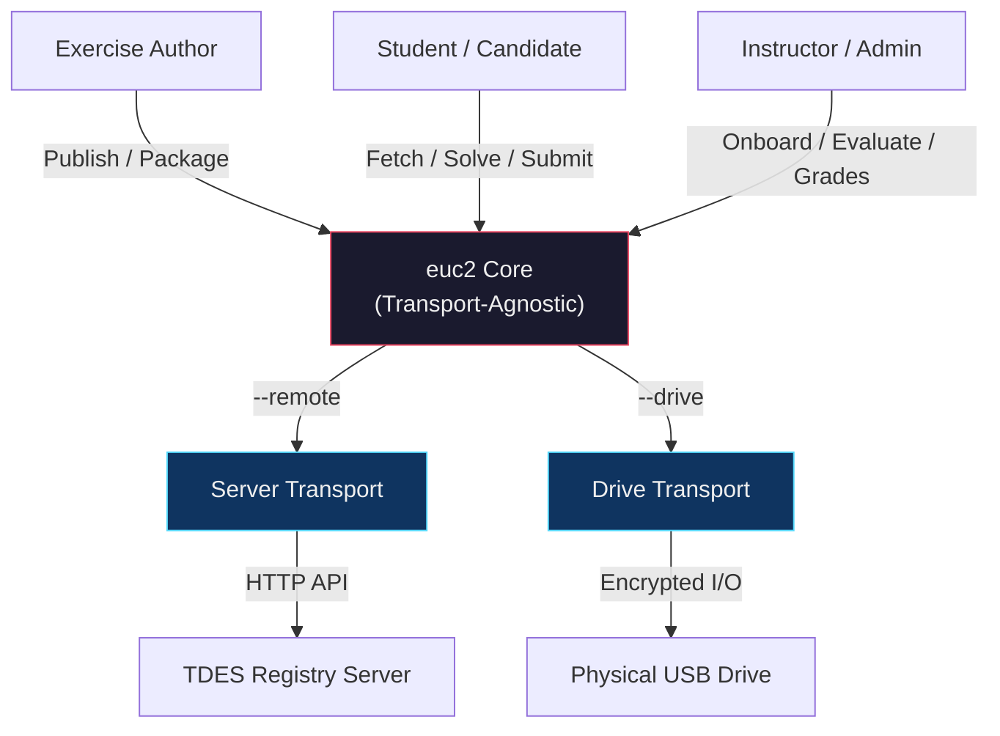
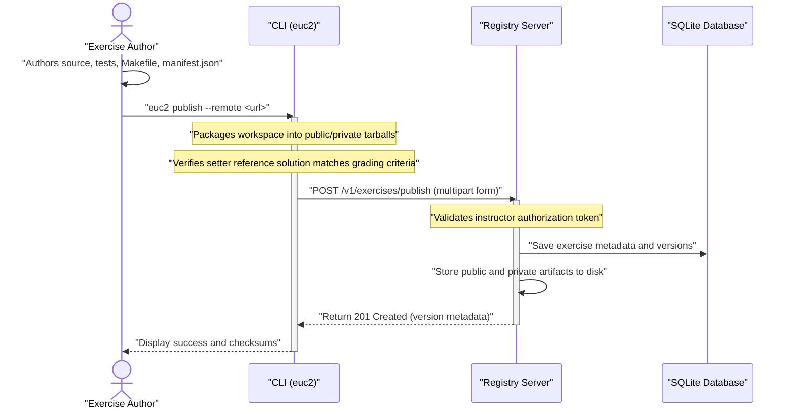
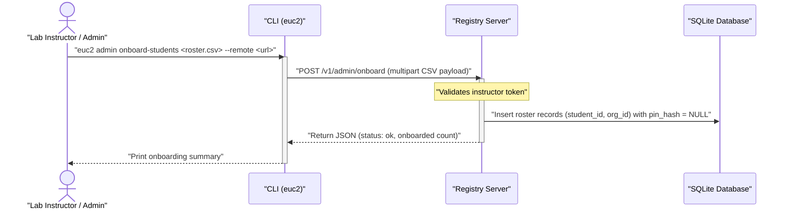
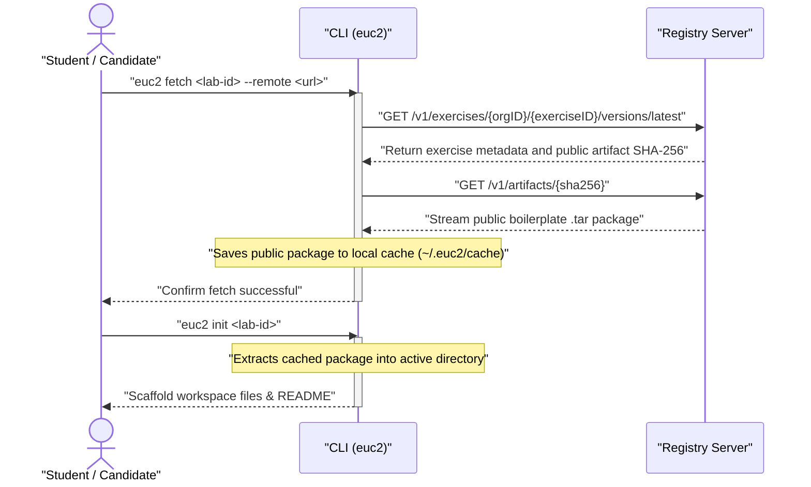
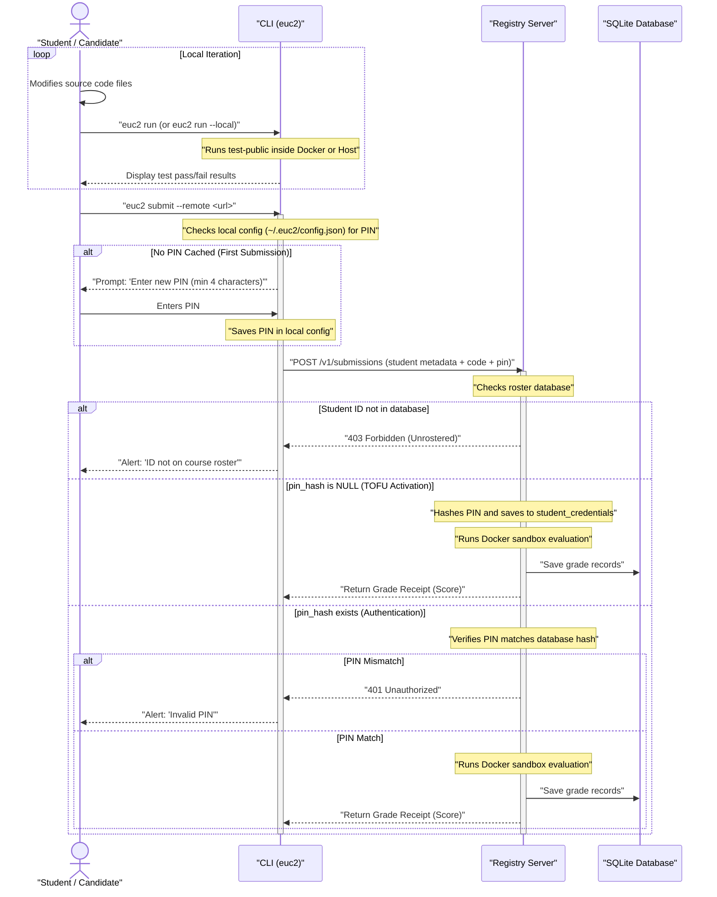
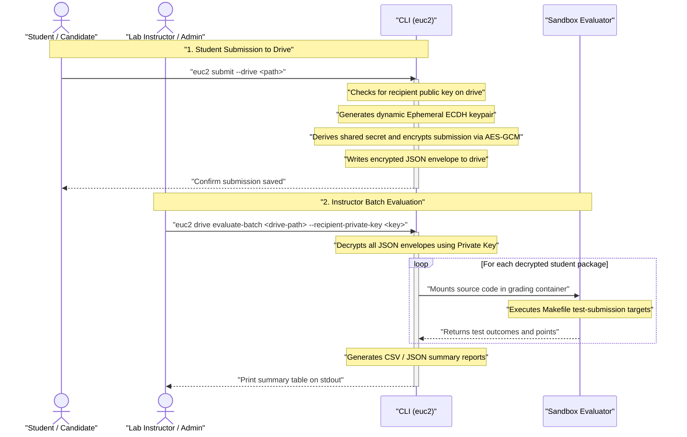
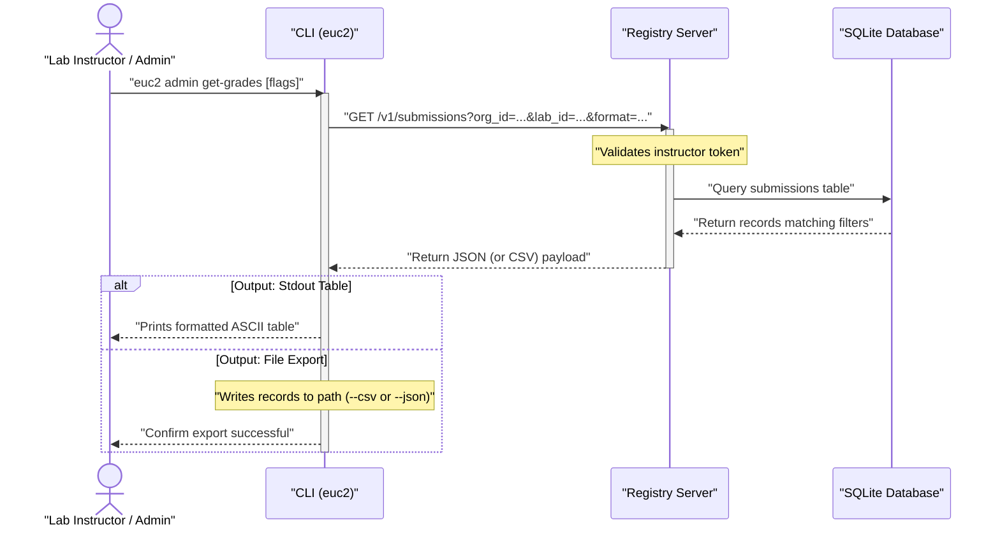

# Test Delivery and Evaluation System (TDES) User Flows

This document details the step-by-step user flows, interactions, and system state transitions across all actors (Exercise Authors, Students/Candidates, and Instructors/Admins) in TDES. The system supports multiple pluggable transport layers — including an online server-backed transport and a fully end-to-end offline flash-drive-backed transport.

---

## System Overview

TDES is a **Transport, Delivery, and Evaluation System** for coding labs. Its core design separates the exercise lifecycle (authoring, distribution, submission, evaluation) from how content moves between actors. The CLI (`euc2`) dispatches to different **transport implementations** at runtime based on flags, and the evaluation engine is transport-agnostic — it grades submissions identically regardless of how they arrived.

TDES provides two user interfaces:
- **CLI (`euc2`)** — the primary Go-based command-line tool for all actors.
- **Web UI** — a React-based workbench with Monaco Editor, embedded directly into the `euc2` binary and served via `euc2 ui`.

### Transport Layer Architecture

The CLI selects the transport at runtime based on flags:

| Transport | Flag | Description |
|---|---|---|
| **Server Transport** | `--remote <url>` | Online mode. Communicates with a central TDES Registry Server over HTTP for exercise distribution, submission, PIN-based authentication, and grade retrieval. |
| **Drive Transport** | `--drive <path>` | Fully **end-to-end offline** workflow using physical media (e.g. USB flash drives). Exercises are distributed via the drive, students submit encrypted envelopes to it (X25519/AES-GCM), and the instructor collects and batch-evaluates — all without network access. |

Additional transports can be added by implementing matching fetch/submit methods and wiring them into the CLI's flag-based dispatch.



---

## 1. Exercise Authoring & Publishing Flow

### Goal
An exercise author designs a programming lab, packages it, and publishes it to the registry server so it becomes available to candidates.

### Sequence Diagram


### Steps & State Changes
1. **Lab Authoring**: The author creates a directory containing:
   * `manifest.json`: Metadata, target file definitions, and grading configuration.
   * `Makefile`: Implements `test-public` (for student local runs) and `test-submission-<group>` (for sandbox grading).
   * `README.md` and skeleton source files.
   * `reference/`: A folder containing the author's reference solution.
2. **Execution**: The author runs `euc2 publish --remote <url> --bearer-token <token>`.
3. **Packaging**: The CLI executes `euc2 package` internally. It runs the reference solution against the private tests inside a local Docker container. On success, it separates the files into a `public` (student boilerplate) and a `private` (private tests + reference solution) package.
4. **Publishing**: The CLI sends a `POST /v1/exercises/publish` multipart request to the registry server.
5. **Authorization Check**: The server verifies the token against `EUC2_INSTRUCTOR_TOKENS`.
6. **Server Storage**: The server saves the metadata in the SQLite `exercise_versions` table and persists the public and private `.tar` archives in the filesystem under `data/objects`.

---

## 2. Student Onboarding (Roster Ingestion)

### Goal
The instructor registers authorized student IDs for an exam, preventing unauthorized users from claiming identities or hijacking submissions.

### Sequence Diagram


### Steps & State Changes
1. **Roster Preparation**: The instructor prepares a `roster.csv` containing columns for `student_id` and `org_id` (e.g., matching the class registry).
2. **Execution**: The instructor runs:
   ```bash
   euc2 admin onboard-students roster.csv --remote http://localhost:8080 --bearer-token <instructor_token>
   ```
3. **Ingestion**: The CLI sends the CSV to `POST /v1/admin/onboard`.
4. **Database State**: The server inserts rows into the `student_credentials` table. Crucially, the `pin_hash` field is left empty (`NULL`), signifying that the student has been rostered but has not yet activated their account.

---

## 3. Student Fetch & Workspace Initialization

### Goal
A student downloads the public workspace boilerplate for a lab and initializes their environment to begin working.

### Sequence Diagram


### Steps & State Changes
1. **Fetch**: The student runs `euc2 fetch <lab-id> --remote <url>`.
2. **Metadata Fetch**: The CLI calls the registry server to resolve the latest version and the public package's SHA-256 hash.
3. **Artifact Download**: The CLI downloads the public `.tar` package from `GET /v1/artifacts/{sha256}` and stores it in the local cache at `~/.euc2/cache`.
4. **Initialization**: The student navigates to their workspace and runs `euc2 init <lab-id>`. The CLI extracts the cached template files (source skeletons, public tests, Makefile) into the active directory.

---

## 4. Local Solving & PIN Activation (TOFU)

### Goal
Students solve coding tasks, verify their solution using local public tests, and establish their private PIN on their first remote submission.

### Sequence Diagram


### Steps & State Changes
1. **Solve and Verify**: Students edit their workspace files and run `euc2 run` to execute public tests inside a Docker container.
2. **First Submit**: On executing `euc2 submit --remote <url>`:
   * If `~/.euc2/config.json` doesn't exist, the CLI prompts the student to create a private PIN (4+ characters). This PIN is stored in the local config.
3. **Roster Verification**: The server receives the submission. It queries the `student_credentials` table:
   * If the student is not rostered, the server returns `403 Forbidden`.
4. **TOFU Activation**:
   * If the student is rostered but has no PIN hash registered (`pin_hash` is empty), the server hashes the incoming PIN using SHA-256 + Salt (`EUC2_PIN_SALT`), updates the database row, and marks the account activated.
5. **Subsequent Submissions**:
   * If the student already has a registered PIN, the server compares the incoming hashed PIN with the database value. A mismatch returns `401 Unauthorized`. A match allows the submission to proceed to sandbox evaluation.
6. **PIN Rotation**: A student can update their PIN by running `euc2 submit --remote <url> --update-pin <new_pin>`. This updates both the local cached credential and the server's record.

---

## 5. Offline Drive-Backed Submission & Batch Evaluation

### Goal
In environments without internet access, students submit encrypted packages to physical drives. The instructor decrypts and grades them in bulk afterwards.

### Sequence Diagram


### Steps & State Changes
1. **Preparation**: The instructor runs `euc2 drive prepare-submission <drive_path> --recipient-public-key <public_key>` to set up a submission directory containing the public key.
2. **Encrypted Submission**: The student plugs in the drive and runs:
   ```bash
   euc2 submit --drive /Volumes/ExamUSB
   ```
   The CLI reads the recipient public key from the drive, generates an ephemeral X25519 key pair, computes a shared AES-GCM key, and writes the encrypted student submission envelope to `/Volumes/ExamUSB/submissions/submission-<id>.json`.
3. **Batch Evaluation**: The instructor retrieves all drives, hooks them to a grading machine, and runs:
   ```bash
   euc2 drive evaluate-batch /Volumes/ExamUSB --recipient-private-key <private_key> --csv summary.csv --output-dir results/
   ```
4. **Decryption and Grading**: The CLI decrypts all envelopes, runs Docker sandbox evaluations on the fly, logs points, and exports a grading summary `summary.csv` alongside individual detailed JSON reports.

---

## 6. Instructor Grade Retrieval

### Goal
The instructor retrieves, filters, and exports grading data from the registry server.

### Sequence Diagram


### Steps & State Changes
1. **Query**: The instructor queries grades from the server:
   ```bash
   euc2 admin get-grades --org-id org1 --lab-id lab1 --remote http://localhost:8080 --bearer-token <instructor_token>
   ```
2. **Verification**: The server checks that the bearer token is valid.
3. **Output Formats**:
   * **Stdout (Default)**: Prints a aligned terminal table summarizing student IDs, versions, statuses, scores, and timestamps.
   * **CSV (`--csv <path>`)**: Exports the results directly into a structured CSV file.
   * **JSON (`--json <path>`)**: Exports the raw JSON records returned by the server.
